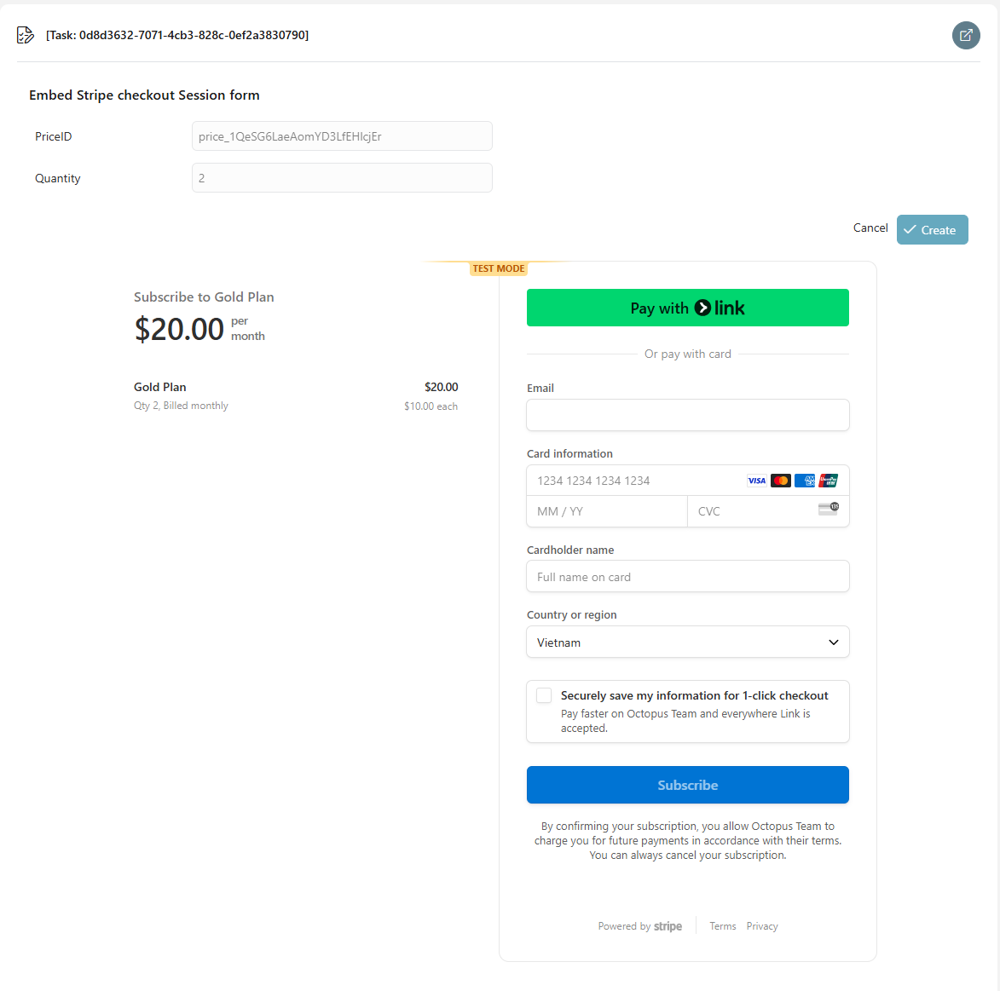
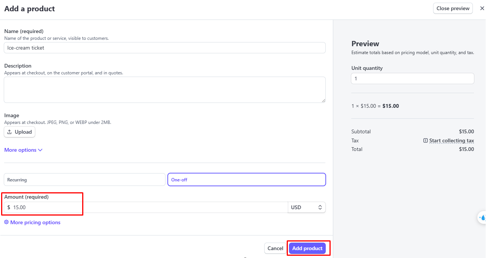

# Stripe-Connector
Stripe is a comprehensive payment processing platform that enables businesses to accept payments online and in-person. It provides a seamless API for integrating various payment methods, including credit/debit cards, digital wallets, bank transfers, and more. 


## Demo

### Use Case: Create a paymentLink based on priceId and quantity
 

#### We can use this link to redirect to the Stripe payment website and make a payment.


### Use Case: Embed the Stripe checkout session page into the form.

- Please input the price ID and quantity, then click submit.
- The Stripe payment checkout session form will be rendered below.


- After filling out the payment form and clicking "Subscribe," the form will be automatically redirected to a successful notification page.


## Setup
1. Create an **Account**: **[here](https://stripe.com/en-de) **
2. Go to the dashboard and search **Developers** ->**API Keys** and Create **Secret key and publishable key**

3. Add new products and set their prices


4. Access the products to obtain the price ID of this product.


5. Open the `Configuration/variables.yaml` in your Designer and set the secretKey and PublishableKey
6. Save the changed settings and start a demo process

```
@variables.yaml@
```
