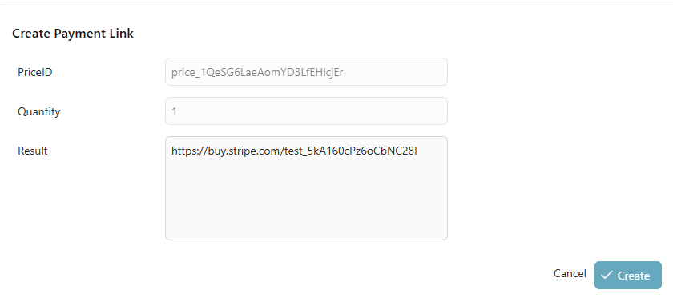
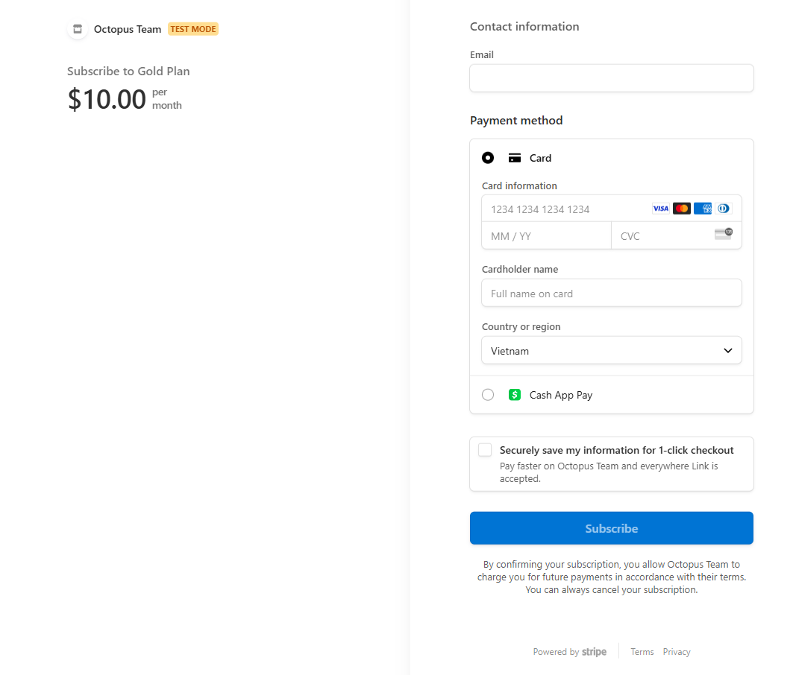
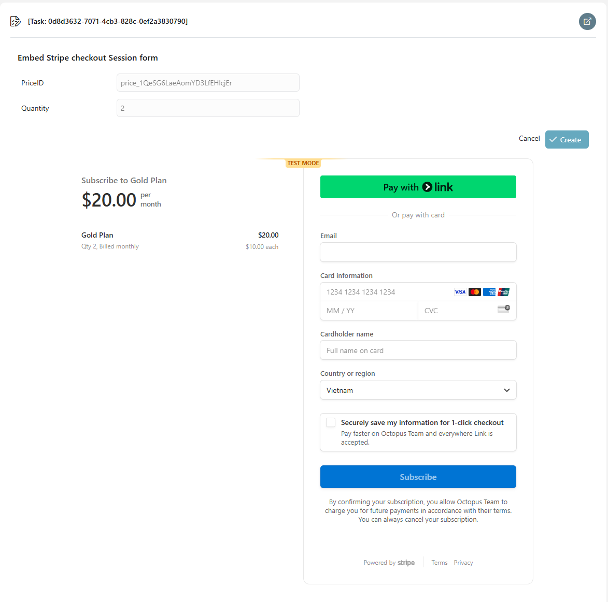
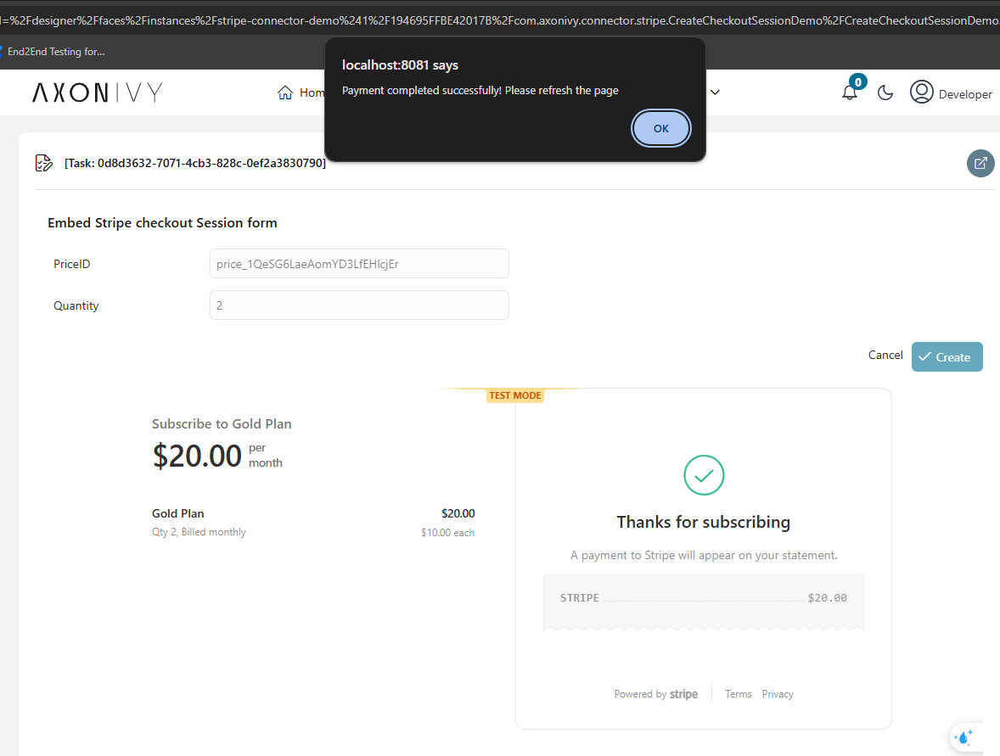
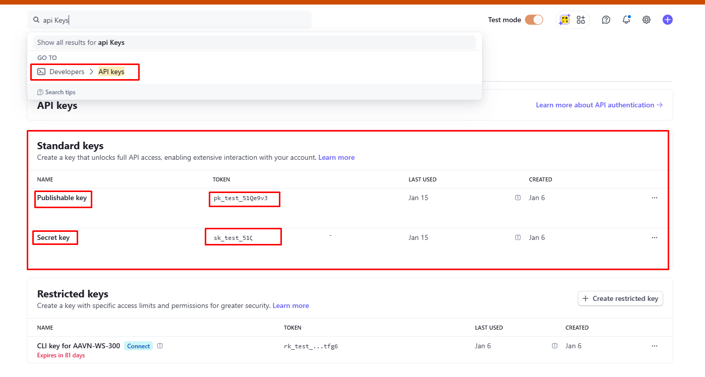
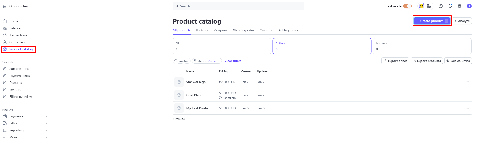
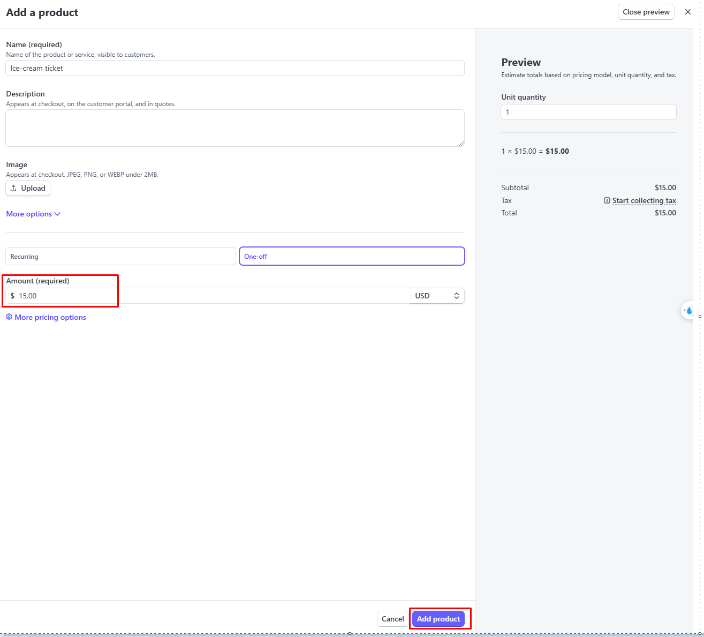
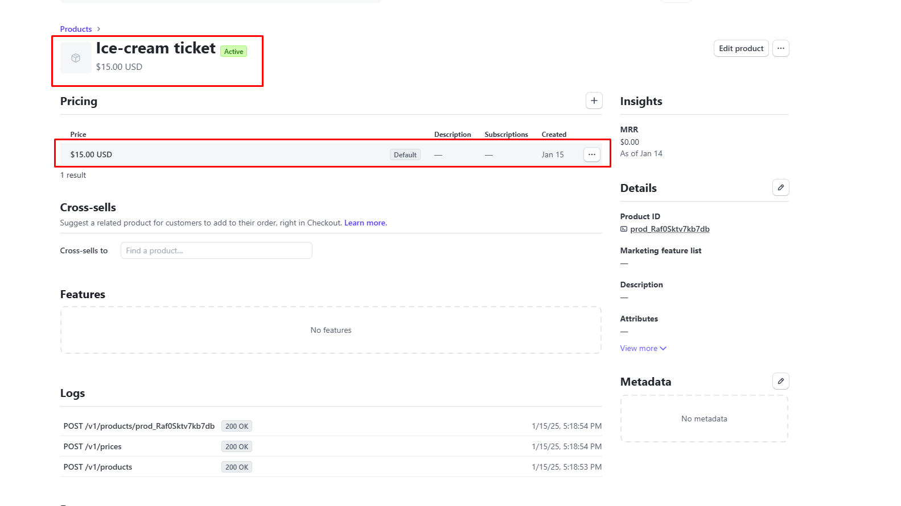
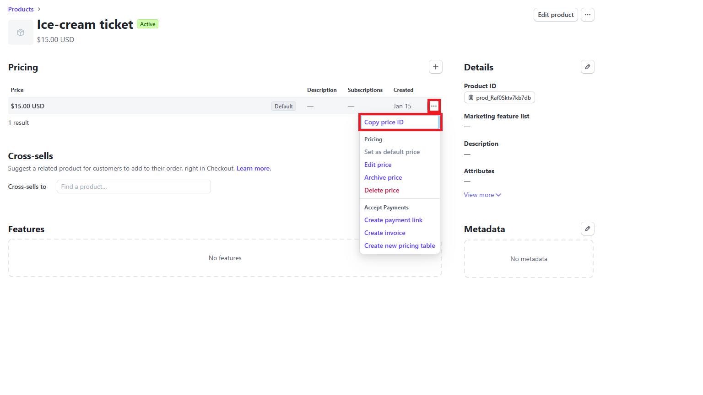

# Stripe Connectors

**Stripe** is a comprehensive **payment processing platform** that enables
businesses to accept **online and in-person payments**. It provides a powerful
API to integrate various payment methods, including **credit/debit cards,
digital wallets, bank transfers**, and more.

We provide a **connector** that seamlessly integrates Stripe's functionality
into a **business process**, enabling automated and efficient payment handling
within Axon Ivy.


### 1. Generating a Payment L ink
 * Based on **priceId** and **quantity**, a **payment link** can be generated.
 * This link redirects the user to the secure **Stripe payment page**, where the
   payment can be completed.

### 2. Embedded Stripe Payment Form
 * The Stripe payment form can be embedded directly into the **Axon Ivy UI**.
 * This allows payments to be processed **within the application** without
   redirecting to Stripe.

## What is a Payment Link?
A **Payment Link** is a URL generated by Stripe that allows customers to make a
payment directly. It contains predefined **prices and quantities** and enables
seamless payment processing through various methods.


## What is the priceId?
The **priceId** is a unique identifier for a price in Stripe. It is
automatically generated when a price is created for a product in the **Stripe
Dashboard**. This **priceId** is used to correctly associate payments and can be
utilized via the API or when creating a Payment Link.


## Demo

### Use Case: Create a paymentLink based on quantity and priceId (please follow installation guide to get the priceId)


#### We can use this link to redirect to the Stripe payment website and make a payment.


### Use Case: Embed the Stripe checkout session page into the form.

- Please input the price ID and quantity, then click submit.
- The Stripe payment checkout session form will be rendered below.
  

- After filling out the payment form and clicking "Subscribe," the form will be
  automatically redirected to a successful notification page.
  

## Setup
1. Create an **Account**: **[here](https://stripe.com/en-de) **
2. Go to the dashboard and search **Developers** ->**API Keys** and Create
   **Secret key and publishable key** 
3. Add new products and set their prices 
   
4. Access the products to obtain the price ID of this product.
   
  - You can copy the priceId from here 
5. Open the `Configuration/variables.yaml` in your Designer and set the
   secretKey and PublishableKey
6. Save the changed settings and start a demo process

```
@variables.yaml@
```
