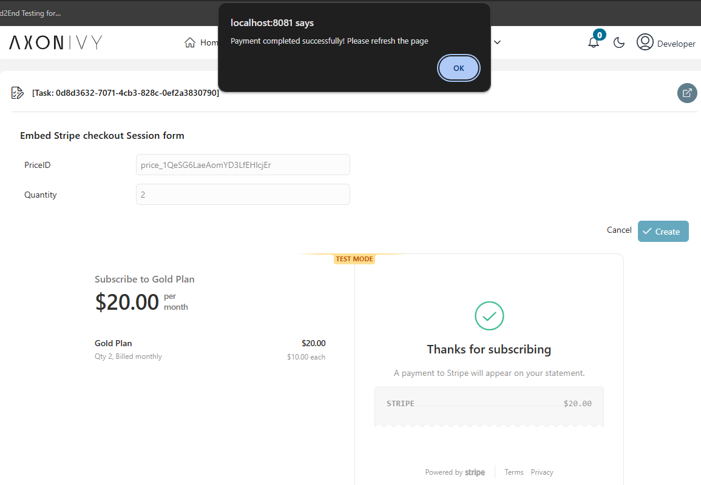
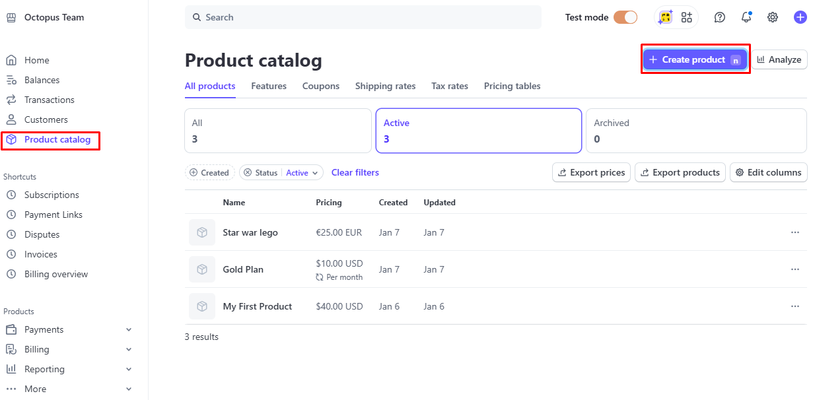
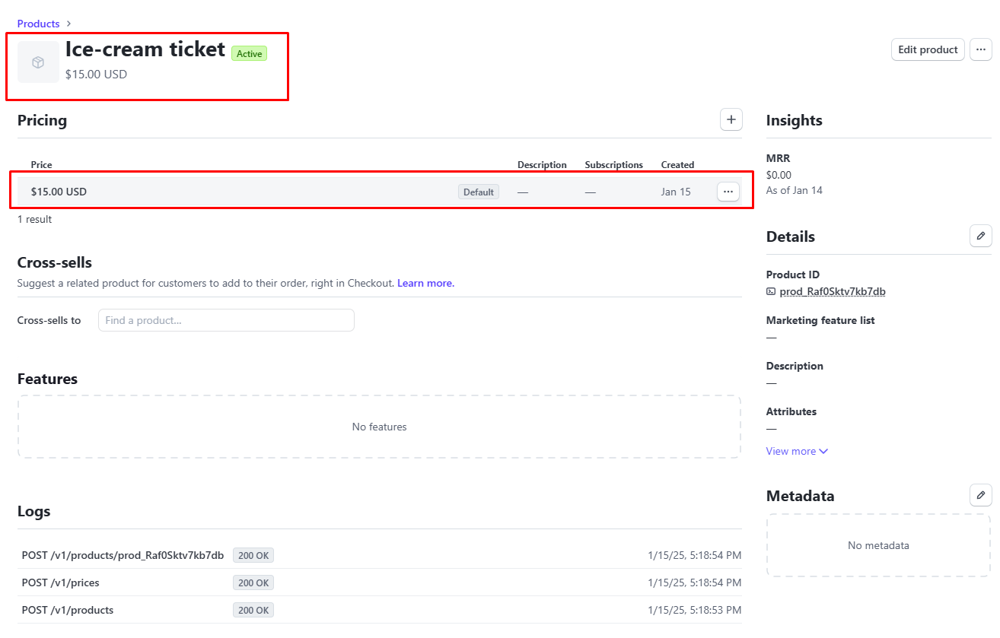

# Stripe Konnektor

**Stripe** ist eine umfassende **Zahlungsabwicklungsplattform**, die es
Unternehmen ermöglicht, **Online- und persönliche Zahlungen** zu akzeptieren.
Sie bietet eine leistungsstarke API zur Integration verschiedener
Zahlungsmethoden, darunter **Kredit-/Debitkarten, digitale Geldbörsen,
Banküberweisungen** und mehr.

Wir bieten einen **-Konnektor**, der die Funktionen von Stripe nahtlos in einen
**-Geschäftsprozess** integriert und so eine automatisierte und effiziente
Zahlungsabwicklung innerhalb von Axon Ivy ermöglicht.


### 1. Generating a Payment L ink
 * Basierend auf **priceId** und **quantity** kann ein **Zahlungslink**
   generiert werden.
 * **Dieser Link leitet den Benutzer zur sicheren Stripe-Zahlungsseite **weiter,
   auf der die Zahlung abgeschlossen werden kann.

### 2. Eingebettetes Stripe-Zahlungsformular
 * Das Stripe-Zahlungsformular kann direkt in die Axon Ivy-Benutzeroberfläche
   **Axon Ivy UI** eingebettet werden.
 * Dadurch können Zahlungen **innerhalb der Anwendung** verarbeitet werden, ohne
   dass eine Weiterleitung zu Stripe erforderlich ist.

## Was ist ein Zahlungslink?
Ein **Zahlungslink** ist eine von Stripe generierte URL, über die Kunden direkt
eine Zahlung vornehmen können. Er enthält vordefinierte **Preise und Mengen**
und ermöglicht eine nahtlose Zahlungsabwicklung über verschiedene Methoden.


## Was ist die priceId?
Die **priceId** ist eine eindeutige Kennung für einen Preis in Stripe. Sie wird
automatisch generiert, wenn ein Preis für ein Produkt im **Stripe Dashboard**
erstellt wird. Diese **priceId** wird verwendet, um Zahlungen korrekt
zuzuordnen, und kann über die API oder beim Erstellen eines Zahlungslinks
verwendet werden.


## Demo

### Anwendungsfall: Erstellen Sie einen paymentLink basierend auf Menge und priceId (befolgen Sie bitte die Installation Guide, um die priceId zu erhalten).


#### Über diesen Link können wir zur Zahlungswebsite von Stripe weitergeleitet werden und eine Zahlung vornehmen.


### Anwendungsfall: Einbetten der Stripe-Checkout-Seite in das Formular.

- Bitte geben Sie die Preis-ID und die Menge ein und klicken Sie dann auf
  „Absenden”.
- Das Stripe-Zahlungsformular wird unten angezeigt.
  

- Nachdem Sie das Zahlungsformular ausgefüllt und auf „Abonnieren” geklickt
  haben, wird das Formular automatisch zu einer Seite mit einer erfolgreichen
  Benachrichtigung weitergeleitet. 

## Einrichtung
1. Erstellen Sie ein Konto bei **** : **[hier](https://stripe.com/en-de) **
2. Gehen Sie zum Dashboard und suchen Sie „ **“ Entwickler** ->**API-Schlüssel**
   und erstellen Sie **einen geheimen Schlüssel und einen veröffentlichbaren
   Schlüssel**
3. Fügen Sie neue Produkte hinzu und legen Sie deren Preise
   fest 
4. Greifen Sie auf die Produkte zu, um die Preis-ID dieses Produkts zu erhalten.
   
  - Sie können die priceId von hier kopieren 
5. Öffnen Sie die Datei „ `Configuration/variables.yaml“` in Ihrem Designer und
   legen Sie den geheimen Schlüssel (secretKey) und den veröffentlichbaren
   Schlüssel (PublishableKey) fest.
6. Speichern Sie die geänderten Einstellungen und starten Sie einen
   Demo-Prozess.

```
@variables.yaml@
```
